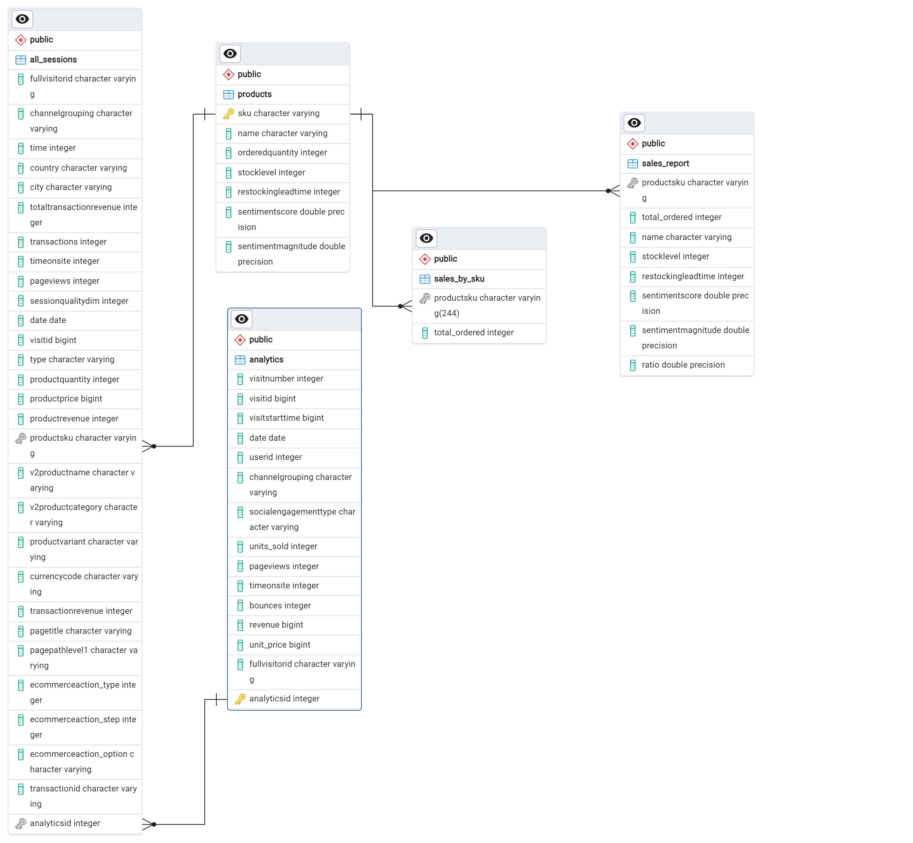

# Final-Project-Transforming-and-Analyzing-Data-with-SQL

## Project/Goals
The goal for this project is to get a better understanding on the process of analyzing data through cleaning, answering and asking the right questions to the data.

## Process
### Rather than starting with cleaning the data, I started with looking at the [questions](/starting_with_questions.md) and seeing what's aksed of me. That way when I know what's needed of me I can look at the data with a purpose and [clean the data](/cleaning_data.md) when necessary.
### After that I asked [my own questions](/starting_with_data.md) in regards to the data. I askd questions that I believe will give a better understanding on what this data represents.
### At the end made some [Quality Assurance questions](/QA.md) and created an ERD diagram where I also had to add a new value to a table to create a primary key to connect it to the whole database (Diagram below)

## Results

Overall the data shows that a large demographic of visitors or users of this site are from the United States and about half of the visitors made a purchase. (if more data was available we could check the reason for why visitors left the site without a purcahse?)

## Challenges 

Biggest challanges were working with a database that has a lot of data missing (NULL) or data that didn't make sense at the begining, for example every revenue or product cost/purchase number was multiplied by a million so I had to divide it by a million with every query.

## Future Goals

Making more queries that give you an answer with percentages to give a more statistical overview and make graphs or charts based on those answers to better visiulize the data.
